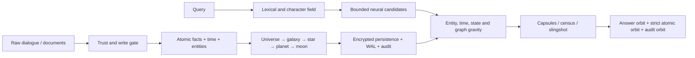

# UMD Planetary Memory / UMD 行星记忆

> A bilingual, auditable long-term memory system for AI agents, built from hierarchical orbits, versioned facts, bounded graph traversal, provenance-preserving capsules, and explicit forgetting.
>
> 一个面向 AI Agent 的双语、可审计长期记忆系统：以层级轨道、版本化事实、有界图遍历、来源守恒胶囊和显式遗忘为核心。

[中文完整白皮书](#中文完整白皮书) · [English full white paper](#english-full-white-paper) · [Source](#代码与复现) · [Results](#公开成绩) · [Limitations](#诚实边界与已知限制)

## Formula inventory / 公式总览

| Published on this README / 已在首页公开 | Count / 数量 |
|---|---:|
| Independent mathematical relations / 独立数学关系 | **46** |
| Core algorithm formula families / 核心算法公式族 | **12** |
| Evaluation metric formulas / 评估指标公式 | **4** |

Every relation has a stable identifier from `UMD-F001` to `UMD-F046`. Algorithm relations are `F001–F028` and `F033–F046`; `F029–F032` preserve the four evaluation definitions. / 每条关系都有 `UMD-F001` 至 `UMD-F046` 的稳定编号；算法关系为 `F001–F028` 与 `F033–F046`，`F029–F032` 保留四个评估定义。

---

# 中文完整白皮书

## 1. 项目状态与诚实声明

当前开发版本是 **UMD 3.33.1**。仓库公开算法源码、公式、工程推导、参数、确定性测试、对抗测试、冻结协议、正式结果 JSON、Python/TypeScript SDK 原型和观察台原型。

这里的“公开计算推理”是指：可验证的设计依据、输入变量、公式、约束、数值算例、消融结果和失败分析。它不包含任何模型供应商的私有隐藏思维链。

公开成绩主要是官方数据上的**来源/证据检索代理指标**，不是官方端到端答案准确率，也不是官方 leaderboard 提交。所有正式结果都声明 `gold_used_for_ranking=false`：系统先完成排序，之后才读取 gold evidence 计算指标。

## 2. 为什么使用“行星系”

传统向量库把每段文本视为平坦、同质、彼此独立的点，容易遇到四类问题：主题层级丢失、旧事实污染当前答案、跨会话证据不完整，以及全量向量和元数据长期占用 RAM。UMD 将记忆建模为一个动态宇宙：

| 宇宙对象 | 计算对象 | 作用 |
|---|---|---|
| 宇宙 | 一个租户/用户的记忆空间 | 隔离权限、密钥和配额 |
| 星系 | 项目、领域或长期身份 | 限定大的检索边界 |
| 恒星 | 稳定主题、人物或任务 | 聚合长期上下文 |
| 行星 | 事件、事实、偏好或程序经验 | 主要可检索单元 |
| 卫星 | 局部细节、来源和相邻证据 | 补全答案证据 |
| 小行星带 | 弱相关、噪声或候选证据 | 有界候选池 |
| 引力边 | 语义、实体、时间、因果和从属关系 | 图扩展与多跳推理 |
| 反物质 | 删除、取消、失效和否定 | 排斥旧答案但保留审计 |
| 事件视界 | 有限上下文预算的压缩边界 | 控制输出规模 |
| 引力弹弓 | 通过中间实体的多跳路径 | 找到间接答案 |

这个比喻不是界面装饰。每个对象都映射到实际数据结构、状态转换、排序项或预算约束。

## 3. 系统总流程



### 写入路径

1. 校验租户、主体、权限和来源。
2. 将来源文本保存为不可变 provenance；提示注入文本不能自行获得系统权限。
3. 确定性规则提取基础时间、实体和值；可选 LLM 只能提出候选实体、关系和时间。
4. 把复合句拆成原子事实：`(subject, predicate, object, valid_time, knowledge_time, source_id, tenant, state)`。
5. 写入门控综合显式重要度、可信度、新颖度、未来效用、重复度和风险；LLM 不能绕过门控。
6. 同一 `(subject, predicate)` 的新值创建新版本边；旧边变为 `superseded`，不会被静默覆盖。
7. 原子提交事实、索引、审计事件和事务日志；失败则整体回滚。
8. 活跃工作集留在 RAM，冷事实、历史元数据和日志留在持久层。

### 查询路径

1. 分析查询模式：直接事实、当前状态、历史、因果、时间、指令/偏好、集合/统计或多跳。
2. BM25 与字符 n-gram 形成第一候选场。
3. 只对有界候选执行神经嵌入相似度，避免全库向量常驻。
4. 融合主题层级、实体、值、时间、局部图和状态质量。
5. 根据问题选择事件卫星、集合 census、胶囊或三跳引力弹弓。
6. 同时返回 Final 胶囊轨道、Strict 原子轨道和 Audit 审计轨道。

## 4. 记忆状态、版本和遗忘

核心状态为：

- `provisional`：新写入、尚未充分确认；
- `stable`：高可信或重复验证；
- `superseded`：被更新版本替代；
- `tombstone`：明确删除、取消或失效；
- `archived`：移出活跃 RAM，但仍可恢复和审计。

当前问题和历史问题使用不同状态场。当前问题降低负事实和旧版本的答案质量；历史/演化问题保持版本中性，以重建变化过程。失效来源从 Answer orbit 排除，但仍留在 Audit orbit：

`Answer(C) = C − NegativeSourceIDs`

`Audit(C) = C`

因此“遗忘”不是只删除一个向量，而是同步更新状态、版本边、索引、缓存、事务日志、答案轨道和审计轨道。

## 5. 全部核心算法与版本演进

| 版本 | 公开能力 | 主要实现 |
|---|---|---|
| PMD / 3.1 | 重要度、风险、重复度与未来效用写入门控 | `pmd_formula_lab.py` |
| 3.2 | 参数化物理公式实验、质量/距离/衰减 | `umd32_formula_lab.py` |
| 3.3 | 恒星—行星—卫星分层与基础检索融合 | `umd33_formula_lab.py` |
| 3.4 | 对抗检索、受保护重排和前缀稳定 | `benchmarks/tune_umd34.py` |
| 3.5 | 原始文本在线引擎、神经后端、LLM 结构化提取、磁盘存储 | `umd35_*.py` |
| 3.6 | SQLite、事务日志、重启恢复、AES-GCM、多租户、权限 | `umd36_persistent.py` |
| 3.7 | 行星运行时、实体/时间轨道和深层图关系 | `umd37_planetary.py` |
| 3.8 | 宇宙状态、复杂关系和规模测试 | `umd38_cosmic.py` |
| 3.9 | 平台、SDK、服务端、控制台和冻结七场引力 | `umd39_platform.py`, `benchmarks/umd39_benchmarks.py` |
| 3.10 | 指令、偏好、任务的认知路由 | `umd310_cognitive.py` |
| 3.11 | 后期交互和查询相关细粒度重排 | `umd311_late.py` |
| 3.12 | provenance 胶囊、条带卫星与完整召回 | `umd312_capsules.py` |
| 3.13 | 相对引力、跨主题牵引和实体接触 | `umd313_gravity.py` |
| 3.14 | Lagrange 约束、瞬态桥、三轮对抗修复 | `umd314_lagrange.py`, `umd314_adversarial*.py` |
| 3.15 | 事件卫星、事件预算和状态感知重排 | `umd315_event_lagrange.py` |
| 3.16–3.18 | 事件视界、状态场、事实行星、Roche 首胶囊、跨集适配 | `benchmarks/umd316_*`–`umd318_*` |
| 3.19 | 可学习引力排序器；训练产物不随仓库发布 | `benchmarks/umd319_ranker.py`, `umd319_train.py` |
| 3.20–3.24 | 新物质、介子场、元变稳定、强对抗、安全修复、开放域逃逸速度 | `benchmarks/umd321_*`–`umd324_*` |
| 3.25 | 反物质遗忘与旧事实污染控制 | `benchmarks/umd325_adapter.py` |
| 3.26 | 银河 census、集合/统计与状态扇区 | `benchmarks/umd326_adapter.py` |
| 3.27 | 版本事实、结构化 ledger、冻结参数 | `benchmarks/umd327_adapter.py` |
| 3.28/3.28.2 | 多轨检索、正式冻结考试与持续优化 | `benchmarks/umd3282_*` |
| 3.29 | 增量边际覆盖、查询不变量和共享状态缓存，保持排序等价 | `benchmarks/umd329_performance_test.py` |
| 3.30 | 版本化事实图、三跳引力弹弓、回声小行星带 | `benchmarks/umd330_adapter.py` |
| 3.31 | 输出槽引力、四跳证据闭包、依赖来源轨道、严格原子闭包排序 | `benchmarks/umd331_adapter.py` |
| 3.32.1 | 关系叠加、五跳覆盖坍缩、答案路径共识、版本影子轨道、严格原子列展开 | `benchmarks/umd332_adapter.py` |
| 3.33.1 | 重叠重建、双文档恒星、置信门、终点吸收边界与循环能量 | `benchmarks/umd333_adapter.py` |

### 5.0 中文公式注册表：46 个独立关系

下面的“关系”包括评分方程、集合关系、分段状态函数、版本选择规则和指标定义。36 个算法关系按十一个核心算法族组织，另保留四个评估指标；同一公式在后文出现的数值展开不重复计数。

#### 公式族 1：归一化与排名融合（3 条）

1. **UMD-F001 — 最大值归一化**：`unit(x_i) = x_i / max_j(x_j)`；当最大值不大于零时结果为 `0`。把不同检索场转换到可融合尺度。
2. **UMD-F002 — 倒数排名**：`RR_i = 1 / (1 + rank_i)`。把离散名次转换为平滑、单调递减的排名质量。
3. **UMD-F003 — 词法/行星种子**：`Seed_i = RR_lexical(i) + 0.72 × RR_planet(group_i)`。在原子词法命中和会话/主题层级之间建立初始轨道。

#### 公式族 2：七场基础引力与状态质量（3 条）

4. **UMD-F004 — 七场基础引力**：`F_i = 0.34S_i + 0.22L_i + 0.16P_i + 0.08C_i + 0.08E_i + 0.06T_i + 0.06G_i`。融合语义 `S`、BM25 `L`、层级 `P`、字符 `C`、实体 `E`、时间 `T` 和图通量 `G`。
5. **UMD-F005 — 状态质量分段函数**：`Δstate_i ∈ {−0.18 negative, +0.08 positive, −0.04 mixed, 0 neutral}`。区分当前有效事实、失效事实和变化过程。
6. **UMD-F006 — 状态修正引力**：`F_state(i) = max(0, F_i + Δstate_i)`。保证负修正不会产生负检索质量；历史模式令 `Δstate=0`。

#### 公式族 3：事件卫星与星座边际覆盖（7 条）

7. **UMD-F007 — 事件卫星分数**：`Event_i = 0.46F_i + 0.30S_i + 0.14L_i + 0.06/(1+rank_i) + 0.04I[new_group]`。选择锚点以外的补充证据。
8. **UMD-F008 — 集合基础相关性**：`B_i = 0.44unit(F_i) + 0.36unit(S_i) + 0.20unit(L_i)`。为集合覆盖建立基础质量。
9. **UMD-F009 — 查询覆盖率**：`query_coverage_i = |T_i ∩ Q| / max(1, |Q|)`。测量候选词元覆盖查询的比例。
10. **UMD-F010 — 新颖度**：`novel_i(t) = |T_i − C_t| / max(1, |T_i|)`。奖励尚未覆盖的信息。
11. **UMD-F011 — 冗余度**：`redundancy_i(t) = |T_i ∩ C_t| / max(1, |T_i ∪ C_t|)`。惩罚与已选证据重复的内容。
12. **UMD-F012 — 星座覆盖总分**：`Coverage_i(t) = B_i + 0.10query_coverage + 0.09I[new_entity] + 0.07I[new_group] + 0.04I[new_date] + 0.08novel − 0.13redundancy`。在相关性、实体/组/日期多样性和冗余之间优化。
13. **UMD-F013 — 增量重叠更新**：`o_i(t+1) = o_i(t) + Σ I[x ∈ T_i], x ∈ (T_selected − C_t)`。UMD 3.29 用 postings 增量更新替代重复集合复制，同时保持排序等价。

#### 公式族 4：指令与偏好引力（2 条）

14. **UMD-F014 — 指令适用性**：`applicability = clip(0.58 × lexical_overlap + 0.42 × family_match, floor, 1)`。只有主题和指令族接触时才激活桥接。
15. **UMD-F015 — 指令瞬态加成**：`directive_bonus = 0.24 + 0.14 × applicability`。指令 floor 为 `0.45`，偏好 floor 为 `0.30`；历史/多证据模式关闭。

#### 公式族 5：胶囊构造与前缀守恒（2 条）

16. **UMD-F016 — 来源胶囊**：`C_k = stable_anchor_k ∪ striped_satellites_k`。一个 Final 排名单元同时携带稳定锚点和条带卫星。
17. **UMD-F017 — 前缀守恒**：`Sources_old(@k) ⊆ Sources_new(@k)`。新优化只能追加证据，不能移除受保护的旧 top-k 命中。

#### 公式族 6：反物质答案/审计双轨（2 条）

18. **UMD-F018 — 当前答案轨道**：`Answer(C) = C − NegativeSourceIDs`。从当前答案排除明确失效、取消或删除的来源。
19. **UMD-F019 — 审计轨道**：`Audit(C) = C`。完整保留正负版本，使历史仍可追溯。

#### 公式族 7：版本化事实图（2 条）

20. **UMD-F020 — 编号事实定义**：`e = (subject, relation, object, ordinal, provenance)`。把事实、版本顺序和来源绑定为不可变图边。
21. **UMD-F021 — 当前可见边**：`e_current(s,r,t) = argmax ordinal(e), source(e) < t`。在可见前缀内选择同一主语/关系的最新版本。

#### 公式族 8：银河 Census（1 条）

22. **UMD-F022 — Census 聚合质量**：`Census_i = 0.37L_i + 0.20F_i + 0.13S_i + 0.22contact_i + 0.02min(4, exact_i) + 0.06I[positive]`。为“列出全部”、计数、统计和推荐建立大集合轨道；非历史失效事实再减 `2.0`。

#### 公式族 9：引力弹弓与回声扩展（2 条）

23. **UMD-F023 — 多跳路径能量**：`Energy(path) = Σ[0.20 + min(3, contact(q,r)/5)] + 6 × I[last_relation ∈ target(q)]`。最多三跳，强奖励命中目标关系的终点路径。
24. **UMD-F024 — 回声集合**：`Echo(a) = {i | casefold(a) 是 casefold(text_i) 的子串}`。使用系统预测对象而非 gold 标签追加最多 96 个证据来源。

#### 公式族 10：输出槽与证据闭包（4 条）

25. **UMD-F025 — 输出槽关系质量**：`Ω(r|q) = 1 − 0.08 × position(r)`，若只命中旧版回退线索则为 `0.50`。优先解析问题要求输出的最终关系，而不是误把中间实体关系当成终点。
26. **UMD-F026 — 四跳闭包路径能量**：`E₃.₃₁(p|q) = Σ[0.20 + min(3, contact(q,r)/5)] + 8 + Ω(r_last|q)`，仅对 `r_last ∈ output_slot(q)` 的路径成立，且 `|p| ≤ 4`。更强的终点势垒和额外一跳用于依赖链重建。
27. **UMD-F027 — 证据闭包轨道**：`Closure(a,p,t) = Primary(a) ∪ Echo(a,t) ∪ ⋃_{e∈p\{e_answer}} provenance(e)`。同时保存答案事实、答案回声和推理路径依赖来源。
28. **UMD-F028 — 严格原子闭包顺序**：`Strict₃.₃₁ = unique(Primary ⧺ Echo ⧺ Dependency ⧺ Strict₃.₃₀)`。每个名次仍严格只含一个来源；优化只改变来源顺序，不靠扩大胶囊宽度提高分数。

#### 四个评估指标公式（4 条）

29. **UMD-F029 — Any Recall**：`Any R@k = mean(I[Y ∩ R_k ≠ ∅])`。至少找回一个 gold 来源的问题比例。
30. **UMD-F030 — Full Recall**：`Full R@k = mean(I[Y ⊆ R_k])`。完整找回全部 gold 来源的问题比例。
31. **UMD-F031 — Micro Recall**：`Micro R@k = Σ|Y ∩ R_k| / Σ|Y|`。跨问题按来源数量加权的总体召回。
32. **UMD-F032 — MRR**：`MRR = mean(1 / rank(first gold retrieval unit))`。第一个 gold 检索单元倒数名次的平均值。

#### 公式族 11：关系叠加与版本影子（8 条）

33. **UMD-F033 — 终点关系叠加**：`ΩΣ(r|q) = max(Ω_head(r|q), Ω_slot(r|q), Ω_cue(r|q))`。同时保留答案头、输出槽和显式关系线索，不再让先命中的单一规则遮蔽其余终点。
34. **UMD-F034 — 边真空能**：`ε(e|q) = 0.20 + min(3, contact(q,r_e)/5)`（关系受查询支持），否则 `−0.18`。负真空能允许跨过必要的隐含中间边，又抑制无关长路径。
35. **UMD-F035 — 五跳覆盖坍缩**：`E₃.₃₂(p|q) = Σ_{e∈p} ε(e|q) + 8 + 1.35ΩΣ(r_last|q) + 1.10|R(p)∩R(q)|/max(1,|R(q)|)`，其中 `|p| ≤ 5`。终点关系、查询关系覆盖和路径长度共同决定坍缩能量。
36. **UMD-F036 — 答案路径共识**：`Consensus(a) = max_{p→a} E₃.₃₂(p|q) + min(0.45, 0.08(N_a−1))`。多条独立路径指向同一预测对象时提供有界加成，避免路径数量无限放大分数。
37. **UMD-F037 — 同序完整性选择**：`e*(s,r) = argmax_e (ordinal(e), |normalize(object_e)|, |provenance(e)|, object_e)`。当同一 `(subject, relation, ordinal)` 出现碎片和完整对象时，确定性选择信息更完整的边。
38. **UMD-F038 — 版本影子轨道**：`Shadow(a,s,r) = ⋃_{e_old∈History(s,r)} [Echo(object(e_old)) ∪ provenance(e_old)]`。当前答案回声之后再携带旧版本证据，使“现值”和“演变”都可审计，且不让旧值占据首位。
39. **UMD-F039 — 自适应闭包视界**：`B_closure = min(256, |Echo ∪ Shadow ∪ Dependency|)`。把 Final 卫星闭包限制在 256 个来源内；容量增大是显式预算，不伪装成排名质量。
40. **UMD-F040 — 严格原子列展开**：`Strict₃.₃₂ = unique(Primary ⧺ Echo ⧺ Shadow ⧺ Dependency ⧺ Col(Result))`，其中 `Col` 先枚举所有胶囊的第 1 个来源，再枚举第 2 个来源，以此类推。每个 Strict 名次仍只包含一个来源。

#### 公式族 12：文档恒星与吸收边界（6 条）

41. **UMD-F041 — 重叠窗口重建**：`O* = mode{max_o suffix(W_i,o)=prefix(W_{i+1},o)}`，并要求至少 75% 相邻窗口共享 `O*`。只在规则重叠流中无损重建长文本。
42. **UMD-F042 — 文档恒星卫星集**：`Moon(D_j) = {i | span(W_i) ∩ span(D_j) ≠ ∅}`。完整 `Document N:` 文档作为恒星，覆盖它的不可变窗口作为来源卫星。
43. **UMD-F043 — 双恒星焦点守恒**：`Final₁³·³³ = Final₁³·³² ∪ Moon(D_(1)) ∪ Moon(D_(2))`。保留旧首胶囊全部来源，并追加前两篇文档的少量卫星。
44. **UMD-F044 — 严格恒星置信门**：`PromoteStrict = I[score(D₁)/max(ε,score(D₂)) ≥ 1.13]`。只有文档首位具有稳定间隔时才提升其内部最强单来源。
45. **UMD-F045 — 完整终点吸收**：`Stop(p,q)=I[R_terminal(q) ⊆ R(p) ∧ r_last∈R_terminal(q)]`。路径覆盖全部查询终点关系后立即停止扩展，防止越过正确答案。
46. **UMD-F046 — 循环与重复关系能量**：`E_absorb(p)=E₃.₃₂(p)−1.25Σ_r max(0,count_p(r)−1)`，且若下一对象已在路径实体集中则拒绝该边。

计数校验：`3 + 3 + 7 + 2 + 2 + 2 + 2 + 1 + 2 + 4 + 8 + 6 = 42` 个算法关系；`42 + 4 = 46` 个独立数学关系。

### 5.1 词法、层级与归一化

对非负向量 `x`：

`unit(x_i) = x_i / max_j(x_j)`，若最大值为零则输出零。

倒数排名融合：

`RR_i = 1 / (1 + rank_i)`

词法和行星层级初始种子：

`Seed_i = RR_lexical(i) + 0.72 × RR_planet(group_i)`

### 5.2 七场基础引力

UMD 3.9 冻结公开数组的基础力：

`F_i = 0.34S_i + 0.22L_i + 0.16P_i + 0.08C_i + 0.08E_i + 0.06T_i + 0.06G_i`

其中 `S` 是神经语义，`L` 是 BM25，`P` 是会话/主题层级，`C` 是字符 n-gram，`E` 是实体和值共振，`T` 是时间相位，`G` 是局部图通量。权重和严格等于 1。生产运行时还有权限和学习效用，但它们在公开原始数组中恒定，因此冻结适配器没有重复计入。

### 5.3 状态质量

对明确的当前状态问题：

- 只有负事实：`Δstate = −0.18`；
- 只有正事实：`Δstate = +0.08`；
- 同时出现新旧状态：`Δstate = −0.04`；
- 中性事实：`0`。

`F_state(i) = max(0, F_i + Δstate_i)`

历史问题把状态增量全部设为零，让变化前后的事实都能被检索。

### 5.4 事件卫星

稳定锚点以外的证据按下式排序：

`Event_i = 0.46F_i + 0.30S_i + 0.14L_i + 0.06/(1+rank_i) + 0.04I[new_group]`

直接事实使用小预算；因果、时间和集合问题使用较大预算。稳定胶囊来源不会再次进入卫星候选池。

### 5.5 星座边际覆盖

集合问题的基础相关性：

`B_i = 0.44unit(F_i) + 0.36unit(S_i) + 0.20unit(L_i)`

在贪心步骤 `t`，已覆盖词元为 `C_t`：

`query_coverage_i = |T_i ∩ Q| / max(1, |Q|)`

`novel_i(t) = |T_i − C_t| / max(1, |T_i|)`

`redundancy_i(t) = |T_i ∩ C_t| / max(1, |T_i ∪ C_t|)`

`Coverage_i(t) = B_i + 0.10query_coverage + 0.09I[new_entity] + 0.07I[new_group] + 0.04I[new_date] + 0.08novel − 0.13redundancy`

UMD 3.29 不改变公式，只增量维护重叠质量：

`o_i(t+1) = o_i(t) + Σ I[x ∈ T_i], x ∈ (T_selected − C_t)`

它消除了重复集合复制。200 个随机等价案例和永久 reference-oracle 测试验证了新旧排序一致。

### 5.6 指令与偏好引力

只有查询模式、主题和指令族匹配时，可信指令/偏好才获得瞬态加成：

`applicability = clip(0.58 × lexical_overlap + 0.42 × family_match, floor, 1)`

`directive_bonus = 0.24 + 0.14 × applicability`

指令 floor 为 `0.45`，偏好 floor 为 `0.30`。历史查找和多证据问题关闭该桥，避免用户偏好覆盖历史事实。

### 5.7 胶囊、条带卫星与守恒

一个排名位置可以是保留来源的胶囊：

`C_k = stable_anchor_k ∪ striped_satellites_k`

旧卫星轨道 `O_old` 的受保护前缀不可变，新证据只能追加。因此：

`Sources_old(@k) ⊆ Sources_new(@k)`

这保证优化 Full Recall 时不会删除旧 top-k 命中。系统同时报告 Strict atomic 轨道，每个位置只有一个 `(source_id,)`，防止通过扩大胶囊宽度虚增 R@1。

### 5.8 银河 census

统计、推荐、“列出所有”和大集合问题采用独立 census：

`Census_i = 0.37L_i + 0.20F_i + 0.13S_i + 0.22contact_i + 0.02min(4, exact_i) + 0.06I[positive]`

非历史模式下，失效事实额外减 `2.0`。聚合问题最多保留 512 个来源，然后对计数、求和、时间窗和分组执行确定性求解，并保留事实级 provenance。

### 5.9 三跳引力弹弓

编号事实表示为：

`e = (subject, relation, object, ordinal, provenance)`

在可见前缀 `t` 内，同一 `(subject, relation)` 选择最新序号：

`e_current(s,r,t) = argmax ordinal(e), source(e) < t`

路径能量：

`Energy(path) = Σ[0.20 + min(3, contact(q,r)/5)] + 6 × I[last_relation ∈ target(q)]`

系统以查询中的最长匹配主体为起点，最多广度优先遍历三条边。胜出的终点事实提升到 Strict 原子首位。预测对象 `a` 产生回声集合：

`Echo(a) = {i | casefold(a) 是 casefold(text_i) 的子串}`

最多追加 96 个回声来源。构图和回声都不读取 gold answer 或 gold evidence ID。普通 LoCoMo 自然对话不满足密集编号事实的激活条件，因此不会走这条路径。

## 6. 数值计算示例

下面公开一个从基础力到评估指标的完整手算例子。

### 6.1 基础引力

假设候选事实的归一化特征为：

`S=0.90, L=0.70, P=0.80, C=0.60, E=1.00, T=0.50, G=0.40`

则：

`F = 0.34×0.90 + 0.22×0.70 + 0.16×0.80 + 0.08×0.60 + 0.08×1.00 + 0.06×0.50 + 0.06×0.40`

`F = 0.306 + 0.154 + 0.128 + 0.048 + 0.080 + 0.030 + 0.024 = 0.770`

若它是当前正事实：`F_state = 0.770 + 0.080 = 0.850`。若它是明确负事实：`F_state = 0.770 − 0.180 = 0.590`。

### 6.2 边际覆盖

假设 `unit(F)=0.85, unit(S)=0.90, unit(L)=0.70`：

`B = 0.44×0.85 + 0.36×0.90 + 0.20×0.70 = 0.838`

再假设查询覆盖 `0.60`、新实体/新组/新日期均为真、新颖度 `0.50`、冗余度 `0.20`：

`Coverage = 0.838 + 0.060 + 0.090 + 0.070 + 0.040 + 0.040 − 0.026 = 1.112`

这个分数只用于相对排序，不解释为概率。

### 6.3 弹弓路径

三条关系与查询的 contact 分别为 `5, 3, 2`，最后关系命中目标关系：

`Energy = (0.20+1.00) + (0.20+0.60) + (0.20+0.40) + 6 = 8.60`

目标关系的 `+6` 终点势能使系统优先完整路径，而不是停在高词法相似的第一跳。

### 6.4 Recall 指标

令问题一 gold 为 `{a,b}`，`R@1={a}`，`R@10={a,b,c}`；问题二 gold 为 `{d}`，`R@1={x}`，`R@10={d,x}`：

- `Any R@1 = (1+0)/2 = 0.5`；
- `Full R@1 = (0+0)/2 = 0`；
- `Any R@10 = 1.0`；
- `Full R@10 = 1.0`；
- `Micro R@1 = 1/(2+1) = 0.3333`。

正式定义如下，其中 `Y` 是 gold evidence 集合，`R_k` 是前 `k` 个检索单元包含来源的并集：

- `Any R@k = mean(I[Y ∩ R_k ≠ ∅])`；
- `Full R@k = mean(I[Y ⊆ R_k])`；
- `Micro R@k = Σ|Y ∩ R_k| / Σ|Y|`；
- `MRR = mean(1 / rank(first gold retrieval unit))`。

## 7. 公开成绩

快照日期：**2026-08-11**。

下表统一展示检索口径，但不同 benchmark 的任务、gold 标注、干扰密度和可评估范围不同，raw score 不能当作统一 Elo 排名。

| 基准 | 可评估范围 | Final Any R@1 | Final Any R@10 | Final Full R@10 | Strict Any R@1 | Strict Any R@10 | Strict Full R@10 |
|---|---:|---:|---:|---:|---:|---:|---:|
| LoCoMo | 1,982 | 0.5605 | 0.9082 | 0.8219 | 0.2861 | 0.7089 | 0.6060 |
| LongMemEval_S | 470 | 0.9468 | 1.0000 | 0.9936 | 0.8979 | 0.9745 | 0.8021 |
| MemBench 分层代理 | 550 | 0.8200 | 0.9982 | 0.9418 | 0.5782 | 0.9509 | 0.6000 |
| Memora | 398 | 1.0000 | 1.0000 | 1.0000 | 1.0000 | 1.0000 | 0.5905 |
| MemoryBench DialSim | 34 | 0.4118 | 0.8824 | 0.2647 | 0.2353 | 0.3235 | 0.0000 |
| MemoryArena reuse | 1,714 | 0.9994 | 1.0000 | 1.0000 | 0.9708 | 1.0000 | 1.0000 |
| MemoryAgentBench UMD 3.33.1 | 1,152 | 0.8681 | 0.9705 | 0.7813 | 0.7639 | 0.8976 | 0.5200 |
| LongMemEval-V2 small | 230 | 0.9304 | 0.9870 | 0.5565 | 0.7652 | 0.9087 | 0.1174 |
| EverMemBench-Dynamic | 202 | 0.8465 | 0.9802 | 0.4604 | 0.4406 | 0.9010 | 0.2327 |

Memora 还得到状态扇区 exact-set rate `0.9925`、旧值污染率 `0.0`，确定性聚合答案验证 `107/107`。

### UMD 3.29 → 3.30 消融

MemoryAgentBench 使用 30/30 上下文、2,800 个问题，其中 1,152 个问题可由冻结切块定位答案来源：

| 指标 | 3.29 | 3.30 | 绝对变化 |
|---|---:|---:|---:|
| Final MRR | 0.6357 | 0.7549 | +0.1192 |
| Final Any R@1 | 0.5078 | 0.6727 | +0.1649 |
| Final Full R@10 | 0.3429 | 0.5712 | +0.2283 |
| Strict Any R@1 | 0.3767 | 0.5556 | +0.1788 |
| Strict Full R@10 | 0.1484 | 0.2595 | +0.1111 |

Accurate Retrieval 子集逐项不变；提升来自 Conflict Resolution 的多跳与冲突事实。图功能带来约 `17.7%` 运行时增加。最大已测结构化上下文包含 1,119 chunks、17,831 facts；事实图稳定 Python 内存 `5.92 MiB`，构建峰值 `15.03 MiB`，构建时间 `0.652 s`。

### UMD 3.30 → 3.31 证据闭包消融

同一 30/30 上下文与 1,152 个可评估问题：

| 指标 | 3.30 | 3.31 | 绝对变化 |
|---|---:|---:|---:|
| Final Any R@1 | 0.6727 | 0.7352 | +0.0625 |
| Final Any R@10 | 0.9271 | 0.9306 | +0.0035 |
| Final Full R@10 | 0.5712 | 0.6189 | +0.0477 |
| Strict Any R@1 | 0.5556 | 0.6398 | +0.0842 |
| Strict Any R@10 | 0.7812 | 0.8290 | +0.0477 |
| Strict Full R@10 | 0.2595 | **0.4141** | **+0.1545** |

Strict Full R@10 相对提升 `59.5%`。Accurate Retrieval 不变；Conflict Resolution 的 Strict Full R@10 从 `0.2737` 提升到 `0.4963`。全量运行时间增加 `6.5%`。详见 `benchmarks/results/UMD331_EVIDENCE_CLOSURE_REPORT.md`。

### UMD 3.31 → 3.32.1 关系叠加消融

同一 30/30 上下文、同一冻结切块与 1,152 个可评估问题，排序阶段仍不读取 gold：

| 指标 | 3.31 | 3.32.1 | 绝对变化 |
|---|---:|---:|---:|
| Final Any R@1 | 0.7352 | **0.8281** | **+0.0929** |
| Final Any R@10 | 0.9306 | **0.9653** | **+0.0347** |
| Final Full R@10 | 0.6189 | **0.7526** | **+0.1337** |
| Strict Any R@1 | 0.6398 | **0.7378** | **+0.0981** |
| Strict Any R@10 | 0.8290 | **0.8880** | **+0.0590** |
| Strict Full R@10 | 0.4141 | **0.5095** | **+0.0955** |

600-chunk 同容量档（603 个可评估问题）达到 Final Any R@1 `0.9370`、Final Full R@10 `0.9701`、Strict Any R@1 `0.9104`、Strict Full R@10 `0.7065`。但这些容量档数字不能替代全量分数。更重要的是，Strict 每个名次只能携带一个来源；在 1,152 题中只有 794 题的 gold 来源数不超过 10，因此 raw Strict Full R@10 的数据集上限是 `794/1152 = 0.6892`，`0.99` 在该指标定义下数学上不可达。在容量档的 600 题 Conflict Resolution 子集上，raw Strict Full R@10 为 `0.7050`，可达上限为 `0.7450`，上限归一化结果为 `0.9463`。完整结果、失败实验与完整性说明见 `benchmarks/results/UMD3321_RELATION_SUPERPOSITION_REPORT.md`。

### UMD 3.32.1 → 3.33.1 双文档恒星消融

| 指标 | 3.32.1 | 3.33.1 | 绝对变化 |
|---|---:|---:|---:|
| Final Any R@1 | 0.8281 | **0.8681** | **+0.0399** |
| Final Full R@10 | 0.7526 | **0.7813** | **+0.0286** |
| Strict Any R@1 | 0.7378 | **0.7639** | **+0.0260** |
| Strict Full R@10 | 0.5095 | **0.5200** | **+0.0104** |

按普通文档路径 88 来源、结构化闭包路径 296 来源的实际预算，Final Full R@10 的 size-only 实现上限约为 `0.9531`，当前达到其 `81.97%`；Strict Full 的 `0.5200` 达到固定上限 `0.6892` 的 `75.44%`。检查点全量墙钟约 `1301.1 s`，比 3.32.1 的同机观测多约 `38%`。详见 `benchmarks/results/UMD3331_BINARY_STAR_REPORT.md`。

### 测试范围边界

- LoCoMo：1,986 问中 4 问无 evidence 标签，评分 1,982 问。
- LongMemEval：500 问中 470 个可回答问题进入检索指标；30 个拒答问题需要答案模型判断。
- MemBench：55 个官方组各取前 10 条，共 550 条，不是 26,637 条全量端到端运行。
- MemoryAgentBench：目前计 Accurate Retrieval 与 Conflict Resolution；未计 Test-Time Learning 和 Long-Range Understanding。
- MemoryArena：数字是前序子任务答案组件复用，不是环境任务成功率；1,714 个可评估问题中 1,599 个来自 group travel planner。
- LongMemEval-V2：只运行 small tier，未运行官方 reader accuracy/LAFS。
- EverMemBench：3,121 问中当前固定日组匹配器能定位 202 问来源，因此 `0.8465` 不是全体答案准确率。
- EvolMem：上游在本地审计时仍标记 under construction，没有公开分数。

## 8. 安全、持久化与多租户

UMD 3.6+ 的公开实现包括：

- SQLite 持久层与有界 RAM 活跃集；
- AES-256-GCM 租户级加密；
- HKDF 派生租户密钥；
- HMAC 链式审计/事务日志；
- 原子提交、回滚和重启恢复；
- 租户隔离、ACL/ABAC 与 capability token；
- 密钥轮换和错误密钥拒绝；
- 编码器身份校验，防止用不同嵌入模型错误恢复索引；
- LLM 提取器输出的 schema、长度、时间和权限校验。

主密钥必须由外部 KMS/HSM 或 secret manager 管理，不能与数据库共同存放。仓库不会提交密钥、数据库、第三方数据、模型权重或训练产物。

## 9. 复杂度与内存策略

- BM25 对查询 postings 稀疏评分，另产生 `O(n)` 输出向量。
- 神经评分只覆盖词法候选池；正式冻结考试候选上限为 64。
- 边际覆盖最多处理 192 个候选；3.29 使用增量 postings 避免重复集合代数。
- census 对聚合问题最多输出 512 个来源。
- 弹弓构图对解析事实线性，使用稀疏主体邻接表；单次遍历最多三跳，回声最多 96 个。
- 冷元数据、密文、WAL 和历史版本可完全移出 RAM；RAM 只保留活跃节点、小索引和有界向量缓存。

## 10. 代码与复现

```bash
git clone https://github.com/HmZ9874/umd-planetary-memory.git
cd umd-planetary-memory
python -m venv .venv
# Windows: .venv\Scripts\activate
# Linux/macOS: source .venv/bin/activate
python -m pip install -r requirements-dev.txt
python -m pytest -q \
  --ignore=benchmarks/vendor \
  --ignore=benchmarks/vendor_exam \
  --ignore=benchmarks/data \
  --ignore=benchmarks/data_exam
python scripts/verify_published_results.py
```

当前快照预期：`126 passed`，以及 `validated_results=16 formula_relations=46 gold_used_for_ranking=false status=pass`。GitHub Actions 在 Python 3.12/Linux 上执行相同验证。

第三方 benchmark 原始数据不随仓库分发。数据布局、命令、SHA-256 与复现差异见 [`docs/REPRODUCIBILITY.md`](docs/REPRODUCIBILITY.md)。正式 JSON 位于 [`benchmarks/results/`](benchmarks/results/)，更细的中英文材料保留在 [`docs/`](docs/)。

## 11. 诚实边界与已知限制

- 这些结果没有证明官方端到端答案准确率。
- Final 胶囊成绩和 Strict 单来源成绩必须分开解读。
- 尚未完成同硬件、同 LLM、同预算下与商业记忆服务的公平比较。
- 非模板化开放图推理仍受确定性关系解析器覆盖率限制。
- 回声对象过于常见时必须依赖容量上限避免上下文膨胀。
- 尚无七天以上真实用户故障率、成本和质量漂移报告。
- 尚未通过同行评审、官方 leaderboard 认证或生产安全认证。

## 12. 许可

当前未选择开源许可证。公开可见不等于自动授予复制、修改或再分发权。若要复用，请先联系仓库所有者；正式开源前应添加明确的 `LICENSE`。

---

# English full white paper

## 1. Status and integrity statement

The current development release is **UMD 3.33.1**. The repository publishes the algorithm lineage, equations, engineering derivations, parameters, deterministic and adversarial tests, frozen protocols, formal result JSON, Python/TypeScript SDK prototypes, and an observatory console prototype.

“Published reasoning” here means auditable design rationale, variables, equations, constraints, worked calculations, ablations, and failure analysis. It does not mean private hidden chain-of-thought from any model provider.

The reported scores are primarily **source/evidence retrieval proxies on official data**. They are not official end-to-end answer accuracy and are not official leaderboard submissions. Every formal manifest states `gold_used_for_ranking=false`: ranking completes before gold evidence is read for metric calculation.

## 2. Why a planetary system

Flat vector stores treat chunks as homogeneous, independent points. This loses hierarchy, allows stale facts to pollute current answers, under-recovers distributed evidence, and encourages all vectors and metadata to remain in RAM. UMD instead models memory as a dynamic universe:

| Physical object | Computational object | Purpose |
|---|---|---|
| Universe | one tenant/user memory space | permissions, keys, and quota isolation |
| Galaxy | project, domain, or long-lived identity | coarse retrieval boundary |
| Star | stable topic, person, or task | long-lived context aggregation |
| Planet | event, fact, preference, or procedure | primary retrieval unit |
| Moon | detail, source, or adjacent evidence | evidence completion |
| Asteroid belt | weak, noisy, or candidate evidence | bounded candidate pool |
| Gravitational edge | semantic, entity, temporal, causal, or ownership relation | graph expansion and reasoning |
| Antimatter | deletion, cancellation, invalidation, or negation | repel stale answers, retain audit |
| Event horizon | compression boundary under a context budget | bound output size |
| Slingshot | multi-hop path through intermediate entities | indirect-answer retrieval |

The metaphor is executable: every object maps to a data structure, state transition, ranking term, or budget.

## 3. End-to-end pipeline

### Write path

1. Validate tenant, principal, authority, and source.
2. Preserve source text as immutable provenance; prompt-injection text cannot grant itself system authority.
3. Deterministic rules extract basic time, entities, and values. An optional LLM may only propose structured candidates.
4. Split compound text into atomic facts: `(subject, predicate, object, valid_time, knowledge_time, source_id, tenant, state)`.
5. Gate writes using explicit importance, trust, novelty, future utility, duplication, and risk. The LLM cannot bypass the gate.
6. A new value for `(subject, predicate)` creates a versioned edge; the previous edge becomes `superseded` instead of being overwritten.
7. Atomically commit facts, indexes, audit events, and WAL records, or roll the transaction back.
8. Keep only the active working set in RAM; persist cold facts, historical metadata, and logs.

### Read path

1. Detect direct, current-state, historical, causal, temporal, directive/preference, set/aggregate, or multi-hop mode.
2. Build a lexical field using BM25 and character n-grams.
3. Compute neural similarity only for a bounded candidate set.
4. Fuse hierarchy, entities, values, time, local graph flux, and state mass.
5. Invoke event satellites, galactic census, capsules, or a three-hop slingshot as required.
6. Return separate Final capsule, Strict atomic, and Audit orbits.

## 4. State, versioning, and forgetting

The main states are `provisional`, `stable`, `superseded`, `tombstone`, and `archived`. Current-state queries penalize invalid and stale facts; historical queries remain version-neutral so the transition can be reconstructed.

Invalid sources are removed from the answer orbit but retained in the audit orbit:

`Answer(C) = C − NegativeSourceIDs`

`Audit(C) = C`

Forgetting therefore updates state, versioned edges, indexes, caches, WAL, answer channels, and audit channels. It is not merely vector deletion.

## 5. Complete algorithm lineage

| Release | Public contribution | Main implementation |
|---|---|---|
| PMD / 3.1 | write gate from importance, risk, duplication, and future utility | `pmd_formula_lab.py` |
| 3.2 | parameterized mass, distance, and decay experiments | `umd32_formula_lab.py` |
| 3.3 | star–planet–moon hierarchy and base fusion | `umd33_formula_lab.py` |
| 3.4 | adversarial retrieval, protected reranking, prefix stability | `benchmarks/tune_umd34.py` |
| 3.5 | online raw-text engine, neural backend, guarded LLM extraction, storage | `umd35_*.py` |
| 3.6 | SQLite, WAL, restart recovery, AES-GCM, tenancy, authorization | `umd36_persistent.py` |
| 3.7 | planetary runtime, entity/time orbits, deeper graph relations | `umd37_planetary.py` |
| 3.8 | cosmic state, complex relations, scale tests | `umd38_cosmic.py` |
| 3.9 | platform, SDK, server, console, frozen seven-field gravity | `umd39_platform.py`, `benchmarks/umd39_benchmarks.py` |
| 3.10 | cognitive routing for instructions, preferences, and tasks | `umd310_cognitive.py` |
| 3.11 | late interaction and query-dependent fine reranking | `umd311_late.py` |
| 3.12 | provenance capsules, striped satellites, complete recall | `umd312_capsules.py` |
| 3.13 | relative gravity, cross-topic attraction, entity contact | `umd313_gravity.py` |
| 3.14 | Lagrange constraints, transient bridges, three-round repair | `umd314_lagrange.py`, `umd314_adversarial*.py` |
| 3.15 | event satellites, event budgets, state-aware reranking | `umd315_event_lagrange.py` |
| 3.16–3.18 | event horizons, state fields, fact planets, Roche-first capsules, cross-suite adapters | `benchmarks/umd316_*`–`umd318_*` |
| 3.19 | learned gravity ranker; learned binaries are excluded | `benchmarks/umd319_ranker.py`, `umd319_train.py` |
| 3.20–3.24 | new matter, meson fields, metamorphic stability, red-team repair, open-domain escape velocity | `benchmarks/umd321_*`–`umd324_*` |
| 3.25 | antimatter forgetting and stale-fact contamination control | `benchmarks/umd325_adapter.py` |
| 3.26 | galactic census, aggregation, and state sectors | `benchmarks/umd326_adapter.py` |
| 3.27 | versioned facts, structured ledger, frozen parameters | `benchmarks/umd327_adapter.py` |
| 3.28/3.28.2 | multi-orbit retrieval and frozen formal exam | `benchmarks/umd3282_*` |
| 3.29 | incremental marginal coverage and shared query-state caches with rank equivalence | `benchmarks/umd329_performance_test.py` |
| 3.30 | versioned fact graph, three-hop slingshot, echo asteroid belt | `benchmarks/umd330_adapter.py` |
| 3.31 | output-slot gravity, four-hop evidence closure, dependency provenance orbit, strict atomic closure ordering | `benchmarks/umd331_adapter.py` |
| 3.32.1 | relation superposition, five-hop coverage collapse, answer-path consensus, version shadows, strict atomic column unfolding | `benchmarks/umd332_adapter.py` |
| 3.33.1 | overlap reconstruction, binary document stars, confidence gate, terminal absorption and cycle energy | `benchmarks/umd333_adapter.py` |

### 5.0 English formula registry: 46 independent relations

“Relation” includes scoring equations, set relations, piecewise state functions, version-selection rules, and metric definitions. Thirty-six algorithm relations form eleven core families, with four evaluation metrics retained separately; worked numeric expansions later in the README are not counted again.

#### Family 1: normalization and rank fusion (3)

1. **UMD-F001 — Max normalization**: `unit(x_i) = x_i / max_j(x_j)`, or `0` when the maximum is non-positive. Places heterogeneous retrieval fields on a fusible scale.
2. **UMD-F002 — Reciprocal rank**: `RR_i = 1 / (1 + rank_i)`. Converts a discrete rank into a smooth monotone quality signal.
3. **UMD-F003 — Lexical/planet seed**: `Seed_i = RR_lexical(i) + 0.72 × RR_planet(group_i)`. Establishes the initial orbit from atomic lexical and session/topic hierarchy ranks.

#### Family 2: seven-field gravity and state mass (3)

4. **UMD-F004 — Seven-field gravity**: `F_i = 0.34S_i + 0.22L_i + 0.16P_i + 0.08C_i + 0.08E_i + 0.06T_i + 0.06G_i`. Fuses semantics `S`, BM25 `L`, hierarchy `P`, characters `C`, entities `E`, time `T`, and graph flux `G`.
5. **UMD-F005 — Piecewise state mass**: `Δstate_i ∈ {−0.18 negative, +0.08 positive, −0.04 mixed, 0 neutral}`. Separates current, invalid, and transitional facts.
6. **UMD-F006 — State-adjusted gravity**: `F_state(i) = max(0, F_i + Δstate_i)`. Prevents a negative retrieval mass; historical mode sets `Δstate=0`.

#### Family 3: event satellites and marginal constellation coverage (7)

7. **UMD-F007 — Event satellite score**: `Event_i = 0.46F_i + 0.30S_i + 0.14L_i + 0.06/(1+rank_i) + 0.04I[new_group]`. Selects supporting evidence outside stable anchors.
8. **UMD-F008 — Set base relevance**: `B_i = 0.44unit(F_i) + 0.36unit(S_i) + 0.20unit(L_i)`. Establishes base quality for set coverage.
9. **UMD-F009 — Query coverage**: `query_coverage_i = |T_i ∩ Q| / max(1, |Q|)`. Measures how much of the query is represented by candidate tokens.
10. **UMD-F010 — Novelty**: `novel_i(t) = |T_i − C_t| / max(1, |T_i|)`. Rewards information not covered yet.
11. **UMD-F011 — Redundancy**: `redundancy_i(t) = |T_i ∩ C_t| / max(1, |T_i ∪ C_t|)`. Penalizes overlap with selected evidence.
12. **UMD-F012 — Total constellation coverage**: `Coverage_i(t) = B_i + 0.10query_coverage + 0.09I[new_entity] + 0.07I[new_group] + 0.04I[new_date] + 0.08novel − 0.13redundancy`. Balances relevance, entity/group/date diversity, novelty, and redundancy.
13. **UMD-F013 — Incremental overlap update**: `o_i(t+1) = o_i(t) + Σ I[x ∈ T_i], x ∈ (T_selected − C_t)`. UMD 3.29 replaces repeated set copies with incremental postings while preserving order.

#### Family 4: directive and preference gravity (2)

14. **UMD-F014 — Directive applicability**: `applicability = clip(0.58 × lexical_overlap + 0.42 × family_match, floor, 1)`. Activates only with topic and directive-family contact.
15. **UMD-F015 — Transient directive bonus**: `directive_bonus = 0.24 + 0.14 × applicability`. The floor is `0.45` for instructions and `0.30` for preferences; history and multi-evidence modes disable it.

#### Family 5: capsule construction and prefix conservation (2)

16. **UMD-F016 — Provenance capsule**: `C_k = stable_anchor_k ∪ striped_satellites_k`. One Final rank carries a stable anchor plus striped evidence satellites.
17. **UMD-F017 — Prefix conservation**: `Sources_old(@k) ⊆ Sources_new(@k)`. New optimization may append evidence but cannot remove protected old top-k hits.

#### Family 6: antimatter answer/audit orbits (2)

18. **UMD-F018 — Current-answer orbit**: `Answer(C) = C − NegativeSourceIDs`. Removes invalidated, cancelled, or deleted sources from current answers.
19. **UMD-F019 — Audit orbit**: `Audit(C) = C`. Retains positive and negative versions for historical traceability.

#### Family 7: versioned fact graph (2)

20. **UMD-F020 — Numbered fact definition**: `e = (subject, relation, object, ordinal, provenance)`. Binds the fact, version order, and source into an immutable graph edge.
21. **UMD-F021 — Current visible edge**: `e_current(s,r,t) = argmax ordinal(e), source(e) < t`. Selects the latest subject/relation version visible inside prefix `t`.

#### Family 8: galactic census (1)

22. **UMD-F022 — Census aggregate mass**: `Census_i = 0.37L_i + 0.20F_i + 0.13S_i + 0.22contact_i + 0.02min(4, exact_i) + 0.06I[positive]`. Builds the large-set orbit for list-all, count, aggregate, and recommendation queries; invalid nonhistorical facts receive another `−2.0`.

#### Family 9: gravitational slingshot and echo expansion (2)

23. **UMD-F023 — Multi-hop path energy**: `Energy(path) = Σ[0.20 + min(3, contact(q,r)/5)] + 6 × I[last_relation ∈ target(q)]`. Traverses at most three hops and strongly rewards a terminal target-relation match.
24. **UMD-F024 — Echo set**: `Echo(a) = {i | casefold(a) is a substring of casefold(text_i)}`. Uses the system-predicted object, never gold labels, to append at most 96 evidence sources.

#### Family 10: output slot and evidence closure (4)

25. **UMD-F025 — Output-slot relation mass**: `Ω(r|q) = 1 − 0.08 × position(r)`, or `0.50` for a legacy fallback cue. It resolves the relation requested by the answer slot instead of mistaking an intermediate entity relation for the endpoint.
26. **UMD-F026 — Four-hop closure path energy**: `E₃.₃₁(p|q) = Σ[0.20 + min(3, contact(q,r)/5)] + 8 + Ω(r_last|q)` for `r_last ∈ output_slot(q)` and `|p| ≤ 4`. A stronger terminal barrier and one extra hop reconstruct longer dependency chains.
27. **UMD-F027 — Evidence-closure orbit**: `Closure(a,p,t) = Primary(a) ∪ Echo(a,t) ∪ ⋃_{e∈p\{e_answer}} provenance(e)`. Preserves the answer fact, answer echoes, and the provenance of all path dependencies.
28. **UMD-F028 — Strict atomic closure order**: `Strict₃.₃₁ = unique(Primary ⧺ Echo ⧺ Dependency ⧺ Strict₃.₃₀)`. Every rank remains exactly one source; the gain comes from ordering, not wider capsules.

#### Four evaluation metric formulas (4)

29. **UMD-F029 — Any Recall**: `Any R@k = mean(I[Y ∩ R_k ≠ ∅])`. Fraction of questions retrieving at least one gold source.
30. **UMD-F030 — Full Recall**: `Full R@k = mean(I[Y ⊆ R_k])`. Fraction of questions retrieving the complete gold source set.
31. **UMD-F031 — Micro Recall**: `Micro R@k = Σ|Y ∩ R_k| / Σ|Y|`. Source-count-weighted recall across questions.
32. **UMD-F032 — MRR**: `MRR = mean(1 / rank(first gold retrieval unit))`. Mean reciprocal rank of the first gold-bearing retrieval unit.

#### Family 11: relation superposition and version shadows (8)

33. **UMD-F033 — Terminal-relation superposition**: `ΩΣ(r|q) = max(Ω_head(r|q), Ω_slot(r|q), Ω_cue(r|q))`. Retains answer-head, output-slot, and explicit relation evidence instead of allowing the first matching rule to hide other terminals.
34. **UMD-F034 — Edge vacuum energy**: `ε(e|q) = 0.20 + min(3, contact(q,r_e)/5)` when the query supports the relation, and `−0.18` otherwise. Negative vacuum energy permits a necessary implicit bridge while suppressing irrelevant long paths.
35. **UMD-F035 — Five-hop coverage collapse**: `E₃.₃₂(p|q) = Σ_{e∈p} ε(e|q) + 8 + 1.35ΩΣ(r_last|q) + 1.10|R(p)∩R(q)|/max(1,|R(q)|)`, for `|p| ≤ 5`. Terminal mass, query-relation coverage, and path energy jointly determine collapse.
36. **UMD-F036 — Answer-path consensus**: `Consensus(a) = max_{p→a} E₃.₃₂(p|q) + min(0.45, 0.08(N_a−1))`. Independent paths to the same predicted object receive a bounded bonus, preventing path count from dominating without limit.
37. **UMD-F037 — Equal-ordinal completeness selection**: `e*(s,r) = argmax_e (ordinal(e), |normalize(object_e)|, |provenance(e)|, object_e)`. When fragments and complete objects share `(subject, relation, ordinal)`, the more complete edge wins deterministically.
38. **UMD-F038 — Version-shadow orbit**: `Shadow(a,s,r) = ⋃_{e_old∈History(s,r)} [Echo(object(e_old)) ∪ provenance(e_old)]`. Historical evidence follows the current answer echo, preserving evolution without allowing stale values to occupy rank one.
39. **UMD-F039 — Adaptive closure horizon**: `B_closure = min(256, |Echo ∪ Shadow ∪ Dependency|)`. Final closure satellites are capped at 256 sources; the larger capacity is reported explicitly rather than presented as a pure ranking gain.
40. **UMD-F040 — Strict atomic column unfolding**: `Strict₃.₃₂ = unique(Primary ⧺ Echo ⧺ Shadow ⧺ Dependency ⧺ Col(Result))`, where `Col` enumerates the first source of every capsule before their second source, and so on. Every Strict rank still contains exactly one source.

#### Family 12: document stars and absorbing boundaries (6)

41. **UMD-F041 — Overlap-window reconstruction**: `O* = mode{max_o suffix(W_i,o)=prefix(W_{i+1},o)}`, requiring at least 75% of adjacent windows to share `O*`. Long text is rebuilt only from a regular overlap stream.
42. **UMD-F042 — Document-star moon set**: `Moon(D_j) = {i | span(W_i) ∩ span(D_j) ≠ ∅}`. A complete `Document N:` record is a star and its immutable overlapping windows are source moons.
43. **UMD-F043 — Binary-star focal conservation**: `Final₁³·³³ = Final₁³·³² ∪ Moon(D_(1)) ∪ Moon(D_(2))`. The old first capsule is retained and receives the small moon sets of the top two documents.
44. **UMD-F044 — Strict star-confidence gate**: `PromoteStrict = I[score(D₁)/max(ε,score(D₂)) ≥ 1.13]`. The best atomic moon is promoted only when the first document has a stable lead.
45. **UMD-F045 — Complete-terminal absorption**: `Stop(p,q)=I[R_terminal(q) ⊆ R(p) ∧ r_last∈R_terminal(q)]`. Expansion stops after the path covers every query-supported terminal relation.
46. **UMD-F046 — Cycle and repeated-relation energy**: `E_absorb(p)=E₃.₃₂(p)−1.25Σ_r max(0,count_p(r)−1)`; an edge is rejected when its next object is already in the path entity set.

Count invariant: `3 + 3 + 7 + 2 + 2 + 2 + 2 + 1 + 2 + 4 + 8 + 6 = 42` algorithm relations; `42 + 4 = 46` independent mathematical relations.

### 5.1 Normalization and rank fusion

`unit(x_i) = x_i / max_j(x_j)` for a positive maximum, otherwise zero.

`RR_i = 1 / (1 + rank_i)`

`Seed_i = RR_lexical(i) + 0.72 × RR_planet(group_i)`

### 5.2 Seven-field base gravity

`F_i = 0.34S_i + 0.22L_i + 0.16P_i + 0.08C_i + 0.08E_i + 0.06T_i + 0.06G_i`

`S` is neural semantics, `L` BM25, `P` hierarchy, `C` character n-grams, `E` entity/value resonance, `T` temporal phase, and `G` local graph flux. The weights sum to one.

### 5.3 State mass

For explicit current-state queries, state deltas are `−0.18` for negative-only, `+0.08` for positive-only, `−0.04` for mixed transitions, and `0` for neutral facts:

`F_state(i) = max(0, F_i + Δstate_i)`

Historical queries set all state deltas to zero.

### 5.4 Event satellites

`Event_i = 0.46F_i + 0.30S_i + 0.14L_i + 0.06/(1+rank_i) + 0.04I[new_group]`

Direct queries receive a small satellite budget; causal, temporal, and set queries receive a larger one. Stable capsule sources are excluded from the secondary pool.

### 5.5 Marginal constellation coverage

`B_i = 0.44unit(F_i) + 0.36unit(S_i) + 0.20unit(L_i)`

`query_coverage_i = |T_i ∩ Q| / max(1, |Q|)`

`novel_i(t) = |T_i − C_t| / max(1, |T_i|)`

`redundancy_i(t) = |T_i ∩ C_t| / max(1, |T_i ∪ C_t|)`

`Coverage_i(t) = B_i + 0.10query_coverage + 0.09I[new_entity] + 0.07I[new_group] + 0.04I[new_date] + 0.08novel − 0.13redundancy`

UMD 3.29 preserves the ranking equation and updates overlap incrementally:

`o_i(t+1) = o_i(t) + Σ I[x ∈ T_i], x ∈ (T_selected − C_t)`

Two hundred randomized equivalence cases plus a permanent reference oracle verify ranking equivalence.

### 5.6 Directive gravity

`applicability = clip(0.58 × lexical_overlap + 0.42 × family_match, floor, 1)`

`directive_bonus = 0.24 + 0.14 × applicability`

The floor is `0.45` for instructions and `0.30` for preferences. Historical and multi-evidence queries disable the bridge.

### 5.7 Capsules and conservation

`C_k = stable_anchor_k ∪ striped_satellites_k`

New evidence may be appended but cannot remove the protected old prefix:

`Sources_old(@k) ⊆ Sources_new(@k)`

Strict atomic retrieval is reported separately with one immutable source per rank, preventing capsule width from artificially inflating R@1.

### 5.8 Galactic census

`Census_i = 0.37L_i + 0.20F_i + 0.13S_i + 0.22contact_i + 0.02min(4, exact_i) + 0.06I[positive]`

Invalid facts receive a `−2.0` penalty outside historical mode. Aggregate queries may retain up to 512 sources before deterministic count, sum, time-window, and group operations.

### 5.9 Three-hop slingshot

`e = (subject, relation, object, ordinal, provenance)`

`e_current(s,r,t) = argmax ordinal(e), source(e) < t`

`Energy(path) = Σ[0.20 + min(3, contact(q,r)/5)] + 6 × I[last_relation ∈ target(q)]`

Bounded BFS traverses at most three edges. The winning terminal fact is promoted to strict atomic rank one. Its predicted object creates up to 96 echo sources:

`Echo(a) = {i | casefold(a) is a substring of casefold(text_i)}`

Neither graph construction nor echo expansion reads gold answers or gold evidence IDs.

## 6. Worked calculations

For `S=.90, L=.70, P=.80, C=.60, E=1, T=.50, G=.40`:

`F = .34×.90 + .22×.70 + .16×.80 + .08×.60 + .08×1 + .06×.50 + .06×.40 = .770`

A positive current fact becomes `.850`; a negative fact becomes `.590`.

For `unit(F)=.85, unit(S)=.90, unit(L)=.70`, base coverage is:

`B = .44×.85 + .36×.90 + .20×.70 = .838`

With query coverage `.60`, a new entity/group/date, novelty `.50`, and redundancy `.20`:

`Coverage = .838 + .060 + .090 + .070 + .040 + .040 − .026 = 1.112`

This is a relative ranking score, not a probability.

For a three-edge path with relation contacts `5,3,2` and a terminal target match:

`Energy = (0.20+1.00) + (0.20+0.60) + (0.20+0.40) + 6 = 8.60`

For two questions with gold `{a,b}` and `{d}`, R@1 sets `{a}` and `{x}`, and R@10 sets `{a,b,c}` and `{d,x}`: Any R@1 is `.5`, Full R@1 is `0`, Any/Full R@10 are `1`, and Micro R@1 is `1/3=.3333`.

Formal definitions:

- `Any R@k = mean(I[Y ∩ R_k ≠ ∅])`;
- `Full R@k = mean(I[Y ⊆ R_k])`;
- `Micro R@k = Σ|Y ∩ R_k| / Σ|Y|`;
- `MRR = mean(1 / rank(first gold retrieval unit))`.

## 7. Public results

Snapshot date: **2026-08-11**.

The table normalizes reporting fields, not task difficulty. Benchmarks differ in task design, gold annotation, distractor density, and evaluable scope, so raw scores are not a common Elo ranking.

| Benchmark | Evaluated scope | Final Any R@1 | Final Any R@10 | Final Full R@10 | Strict Any R@1 | Strict Any R@10 | Strict Full R@10 |
|---|---:|---:|---:|---:|---:|---:|---:|
| LoCoMo | 1,982 | 0.5605 | 0.9082 | 0.8219 | 0.2861 | 0.7089 | 0.6060 |
| LongMemEval_S | 470 | 0.9468 | 1.0000 | 0.9936 | 0.8979 | 0.9745 | 0.8021 |
| MemBench stratified proxy | 550 | 0.8200 | 0.9982 | 0.9418 | 0.5782 | 0.9509 | 0.6000 |
| Memora | 398 | 1.0000 | 1.0000 | 1.0000 | 1.0000 | 1.0000 | 0.5905 |
| MemoryBench DialSim | 34 | 0.4118 | 0.8824 | 0.2647 | 0.2353 | 0.3235 | 0.0000 |
| MemoryArena reuse | 1,714 | 0.9994 | 1.0000 | 1.0000 | 0.9708 | 1.0000 | 1.0000 |
| MemoryAgentBench UMD 3.33.1 | 1,152 | 0.8681 | 0.9705 | 0.7813 | 0.7639 | 0.8976 | 0.5200 |
| LongMemEval-V2 small | 230 | 0.9304 | 0.9870 | 0.5565 | 0.7652 | 0.9087 | 0.1174 |
| EverMemBench-Dynamic | 202 | 0.8465 | 0.9802 | 0.4604 | 0.4406 | 0.9010 | 0.2327 |

Memora additionally reports state-sector exact-set rate `0.9925`, stale-value pollution `0.0`, and `107/107` deterministic aggregate-answer validations.

### UMD 3.29 → 3.30 ablation

| Metric | 3.29 | 3.30 | Absolute delta |
|---|---:|---:|---:|
| Final MRR | 0.6357 | 0.7549 | +0.1192 |
| Final Any R@1 | 0.5078 | 0.6727 | +0.1649 |
| Final Full R@10 | 0.3429 | 0.5712 | +0.2283 |
| Strict Any R@1 | 0.3767 | 0.5556 | +0.1788 |
| Strict Full R@10 | 0.1484 | 0.2595 | +0.1111 |

The run covers 30/30 MemoryAgentBench contexts and 2,800 questions; 1,152 questions have answer-bearing sources locatable from frozen chunks. Accurate Retrieval cases remain unchanged; improvements come from multi-hop and conflicting facts in Conflict Resolution. The graph adds about `17.7%` runtime. On the largest measured structured context (1,119 chunks and 17,831 facts), steady graph memory is `5.92 MiB`, construction peak is `15.03 MiB`, and build time is `0.652 s`.

### UMD 3.30 → 3.31 evidence-closure ablation

The comparison uses the same 30/30 contexts and 1,152 evaluable questions.

| Metric | 3.30 | 3.31 | Absolute delta |
|---|---:|---:|---:|
| Final Any R@1 | 0.6727 | 0.7352 | +0.0625 |
| Final Any R@10 | 0.9271 | 0.9306 | +0.0035 |
| Final Full R@10 | 0.5712 | 0.6189 | +0.0477 |
| Strict Any R@1 | 0.5556 | 0.6398 | +0.0842 |
| Strict Any R@10 | 0.7812 | 0.8290 | +0.0477 |
| Strict Full R@10 | 0.2595 | **0.4141** | **+0.1545** |

Strict Full R@10 improves by `59.5%` relative. Accurate Retrieval is unchanged; Conflict Resolution Strict Full R@10 rises from `0.2737` to `0.4963`. Full runtime increases by `6.5%`. See `benchmarks/results/UMD331_EVIDENCE_CLOSURE_REPORT.md`.

### UMD 3.31 → 3.32.1 relation-superposition ablation

The comparison uses the same 30/30 contexts, frozen chunks, and 1,152 evaluable questions. Ranking remains gold-blind.

| Metric | 3.31 | 3.32.1 | Absolute delta |
|---|---:|---:|---:|
| Final Any R@1 | 0.7352 | **0.8281** | **+0.0929** |
| Final Any R@10 | 0.9306 | **0.9653** | **+0.0347** |
| Final Full R@10 | 0.6189 | **0.7526** | **+0.1337** |
| Strict Any R@1 | 0.6398 | **0.7378** | **+0.0981** |
| Strict Any R@10 | 0.8290 | **0.8880** | **+0.0590** |
| Strict Full R@10 | 0.4141 | **0.5095** | **+0.0955** |

The same-capacity 600-chunk run (603 evaluable questions) reaches Final Any R@1 `0.9370`, Final Full R@10 `0.9701`, Strict Any R@1 `0.9104`, and Strict Full R@10 `0.7065`; these capacity figures do not replace the full-run scores. Strict ranks carry exactly one source. Only 794 of the 1,152 full-run questions have at most ten gold sources, so the dataset's raw Strict Full R@10 ceiling is `794/1152 = 0.6892`; `0.99` is mathematically unreachable under this metric definition. On the 600-question Conflict Resolution capacity subset, raw Strict Full R@10 is `0.7050` against a `0.7450` ceiling, or `0.9463` ceiling-normalized. See `benchmarks/results/UMD3321_RELATION_SUPERPOSITION_REPORT.md` for complete results, rejected experiments, and integrity notes.

### UMD 3.32.1 → 3.33.1 binary document-star ablation

| Metric | 3.32.1 | 3.33.1 | Absolute delta |
|---|---:|---:|---:|
| Final Any R@1 | 0.8281 | **0.8681** | **+0.0399** |
| Final Full R@10 | 0.7526 | **0.7813** | **+0.0286** |
| Strict Any R@1 | 0.7378 | **0.7639** | **+0.0260** |
| Strict Full R@10 | 0.5095 | **0.5200** | **+0.0104** |

Using the actual 88-source ordinary-document budget and 296-source structured-closure budget, the subset-aware Final Full R@10 size ceiling is about `0.9531`; the result reaches `81.97%` of it. Strict Full `0.5200` reaches `75.44%` of its fixed `0.6892` ceiling. The checkpointed full run used about `1301.1 s`, roughly `38%` above the same-machine 3.32.1 observation. See `benchmarks/results/UMD3331_BINARY_STAR_REPORT.md`.

### Evaluation boundaries

- LoCoMo scores 1,982 of 1,986 questions; four lack evidence labels.
- LongMemEval retrieval scores 470 answerable questions; 30 abstention questions require an answer model.
- MemBench samples ten records from each of 55 official groups, not the full 26,637-record end-to-end set.
- MemoryAgentBench currently scores Accurate Retrieval and Conflict Resolution, not Test-Time Learning or Long-Range Understanding.
- MemoryArena measures reuse of preceding subtask answer components, not environment success rate; 1,599 of 1,714 eligible questions come from group travel planner.
- LongMemEval-V2 uses only the small tier and does not run official reader accuracy/LAFS.
- EverMemBench locates evidence for 202 of 3,121 questions with the current fixed-day matcher, so `.8465` is not whole-suite answer accuracy.
- EvolMem was still marked under construction upstream during the local audit, so no score is reported.

## 8. Security, persistence, and tenancy

UMD 3.6+ publicly implements bounded-RAM SQLite persistence, tenant-level AES-256-GCM encryption, HKDF-derived keys, HMAC-chained audit/WAL records, atomic commit and rollback, restart recovery, tenant isolation, ACL/ABAC and capability tokens, key rotation, wrong-key rejection, encoder identity checks, and schema/length/time/authority validation for LLM extraction.

The master key must come from an external KMS, HSM, or secret manager. Secrets, databases, third-party datasets, model weights, caches, checkpoints, and learned binaries are excluded from this repository.

## 9. Complexity and memory

- BM25 is sparse over query postings plus an `O(n)` output vector.
- Neural scoring is bounded by the lexical candidate pool; the frozen exam uses 64 candidates.
- Marginal coverage is capped at 192 candidates and uses incremental postings in 3.29.
- Census outputs at most 512 sources for aggregate queries.
- Slingshot graph construction is linear in parsed facts, uses sparse subject adjacency, traverses at most three hops, and appends at most 96 echoes.
- Cold metadata, ciphertext, WAL, and historical versions may stay entirely off-RAM; RAM holds only active nodes, compact indexes, and bounded embedding caches.

## 10. Reproduction

```bash
git clone https://github.com/HmZ9874/umd-planetary-memory.git
cd umd-planetary-memory
python -m venv .venv
# Windows: .venv\Scripts\activate
# Linux/macOS: source .venv/bin/activate
python -m pip install -r requirements-dev.txt
python -m pytest -q \
  --ignore=benchmarks/vendor \
  --ignore=benchmarks/vendor_exam \
  --ignore=benchmarks/data \
  --ignore=benchmarks/data_exam
python scripts/verify_published_results.py
```

Expected for the current snapshot: `126 passed` and `validated_results=16 formula_relations=46 gold_used_for_ranking=false status=pass`. GitHub Actions executes the same validation on Python 3.12/Linux.

Raw third-party benchmark data is not redistributed. See [`docs/REPRODUCIBILITY.md`](docs/REPRODUCIBILITY.md) for data layout, commands, hashes, and caveats; formal manifests are under [`benchmarks/results/`](benchmarks/results/).

## 11. Honest limitations

- These results do not establish official end-to-end answer accuracy.
- Final capsule scores and Strict single-source scores must be interpreted separately.
- No fair same-hardware, same-LLM, same-budget comparison with commercial memory services has been completed.
- Open-ended graph reasoning remains limited by deterministic relation-parser coverage.
- Common echo objects require a hard capacity bound to prevent context inflation.
- There is no seven-day-plus real-user failure-rate, cost, or quality-drift report yet.
- The work has not received peer review, official leaderboard certification, or production security certification.

## 12. License

No open-source license has been selected. Public visibility does not automatically grant rights to copy, modify, or redistribute. Contact the repository owner before reuse; add an explicit `LICENSE` before a formal open-source release.
